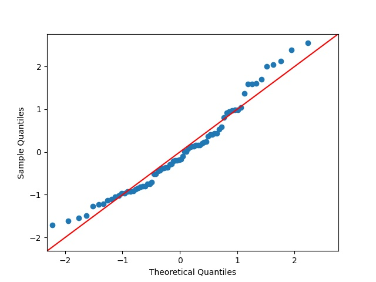
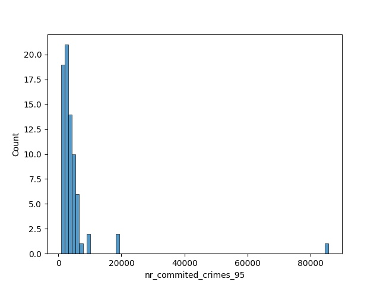
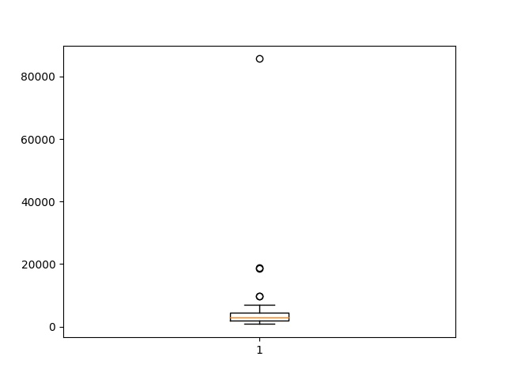
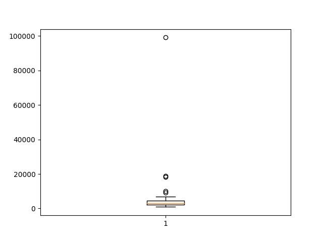

## Data Understanding

# Client
- 'birth_number' gives information about both the birth date and the gender: YYMMDD for men, and YYMM+50DD for women. 
We may need to split this atttribute into 'gender' and 'birth_date'.

# District
- Unemploymant rate '95 is of type object, but should be float. There is an observation with unemployment rate '95 = '?'. It does not follow a normal distribution so we shouldn't replace it with the mean.

- The attribute no. of commited crimes '95 is of type object but should be of type int. There is an observation with no. of commiter crimes '95 = '?' 

- Outlier in the 'no. of inhabitants'

- Outlier in no. of crimes '95

- Outlier in no. of crimes '96

# Loan Train
- The number of successful loans is much higher(TODO) than the number of fraudulent loans(46) - status is unbalanced.

# Loan Test
- 354 null values in status

# Transaction Test
- 5130 null values in operation
- 17419 null values in k_symbol
- 24377 null values in bank
- 21061 null values in account

# Transaction Train
- 70761 null in operation
- 185244 null in k_symbol
- 299443 null in bank
- 294456 null in account

- operation = NaN has always k_symbol = interest credited

- A transaction that is done after the loan is granted, should no be considered in the analysis.
- The 'withdrawal in cash' 'type' should be replaced by 'widthdrawal', because the 'type' should only represent if the transaction is withdrawal(-) or credit(+). Therefore, 'withdrawal in cash' includes duplicated information about the mode of transaction, which is already represented in 'operation':

**A analisar com auxílio de gráficos e estatísticas**
- Relevância das informações do destinatário da transferência
- Pertinência de converter o atributo 'value' para para negativo quando 'type'='withdrawal'
- Relevância do atributo k_symbol

# Database - TODO
- Corrigir types, automaticamente gerados com csvsql
- Possivelmente passar as datas para tipo DATE
- Adicionar novas colunas e mudar existentes (por ex: separar gender da birth date)

# LOGBOOK

- Changed attribute "code" to "district_id" in District table