# Data Understanding

## New Attributes
- Gender
- Birth Date
- Average Transaction Amount
- Average Transaction Balance
- Number of Transactions per Account
- Average Commited Crimes
- Average Unemployment Rate
- Same District - If the owner and account have the same district
- Days Between - Time gap between creating the account and the loan appliance

## Client
- **Extracted attributes**: `gender` and `birth_date`
- `birth_number` gives information about both the birth date and the gender: YYMMDD for men, and YYMM+50DD for women. 
- We need to split this attribute into `gender` and `birth_date`.

- Analysis of the `gender` of the clients:

- The `gender` of the client does not seem to influence the loan status:
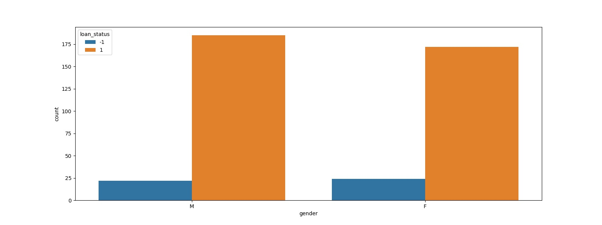

***
## District
- `Unemploymant rate '95` is of type object, but should be float. There is an observation with unemployment rate '95 = '?'. It does not follow a normal distribution so we shouldn't replace it with the mean.
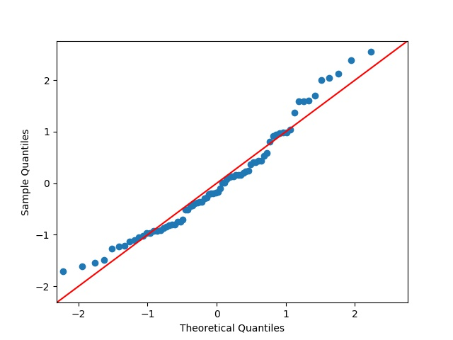

- The attribute `no. of commited crimes '95` is of type object but should be of type int. There is an observation with no. of commiter crimes '95 = '?' 

- Outlier in the `no. of inhabitants`

- Outlier in `no. of crimes '95`
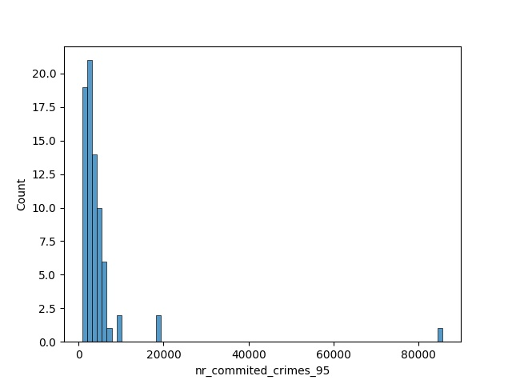
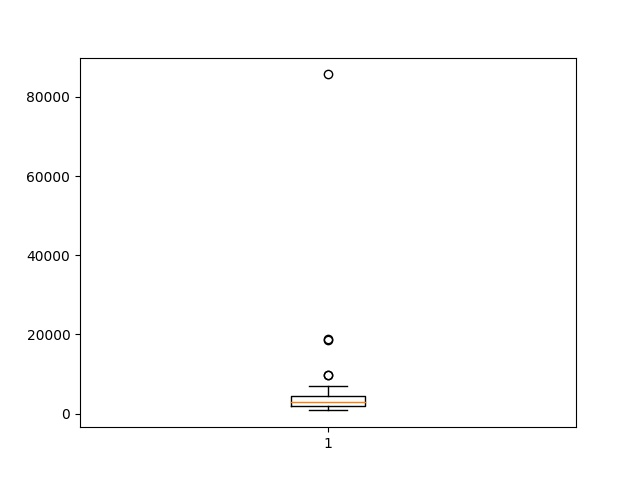

- Outlier in `no. of crimes '96`

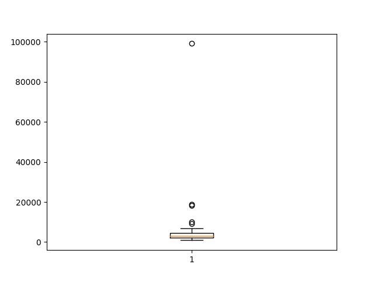

- The districts with more criminality are the ones with higher average salary
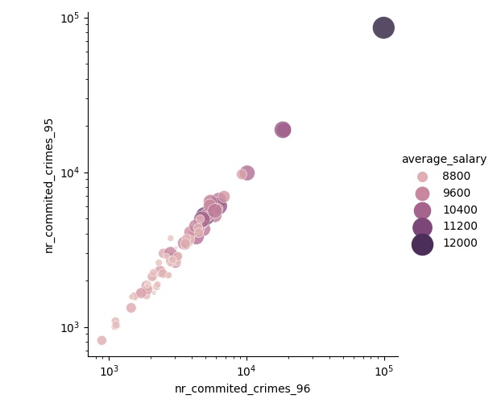

- **Extracted attributes**: average unemployment rate, average number of commited crimes, same_district (account and client have the same district)

***

## Loan Train
- The number of successful loans is much higher than the number of fraudulent loans(46) - `status` is imbalanced.
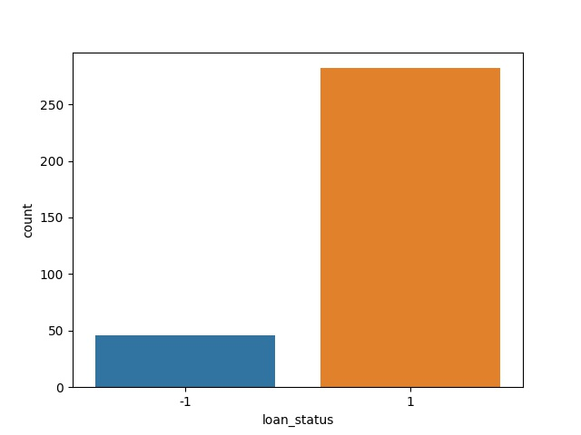

- `amount`/`duration` = `payments`
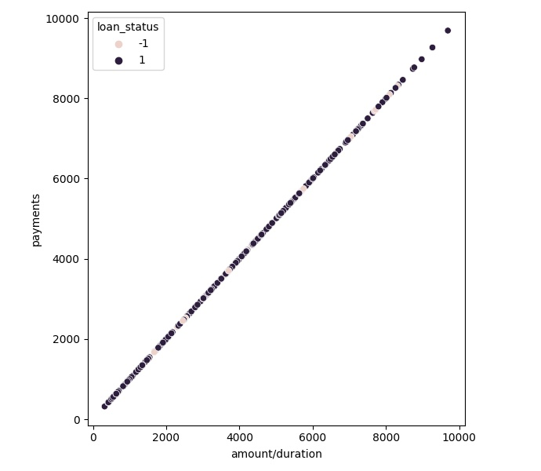

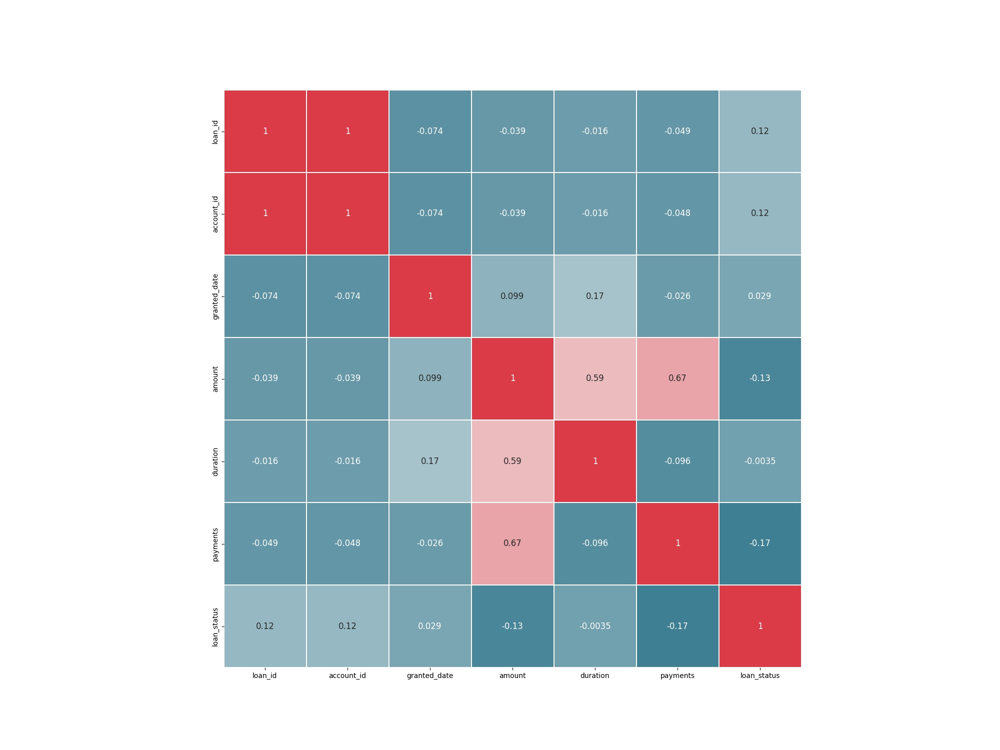

- Loans with a higher `amount` tend to be fraudulent.

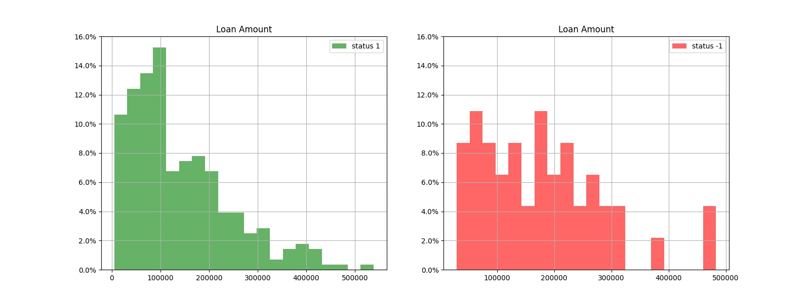

***
## Transaction Train
- 70761 null in operation
- 185244 null in k_symbol
- 299443 null in bank
- 294456 null in account

- The **withdrawal in cash** `type` should be replaced by **withdrawal**, because the `type` should only represent if the transaction is withdrawal(-) or credit(+). Therefore, **withdrawal in cash** includes duplicated information about the mode of transaction, which is already represented in 'operation':
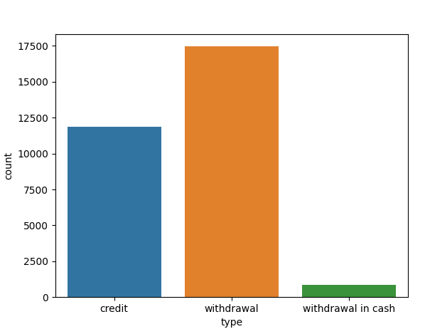

- Most of the transactions don't specify the `bank` and the quantity of transactions to each bank is almost the same.

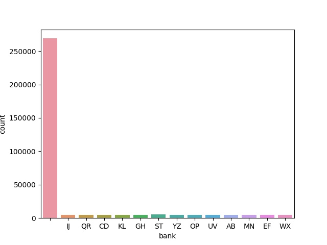

- `operation` = NaN has always `k_symbol` = interest credited

- A transaction that is done after the loan is granted, should no be considered in the analysis.

- **Extracted attributes**: average transaction balance, average transaction amount, number of transactions of the account

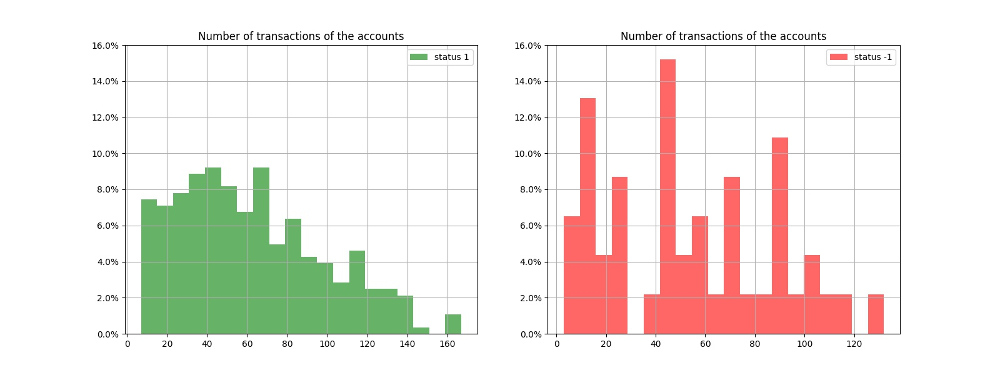
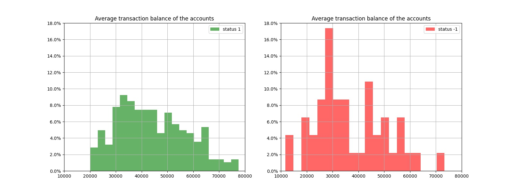
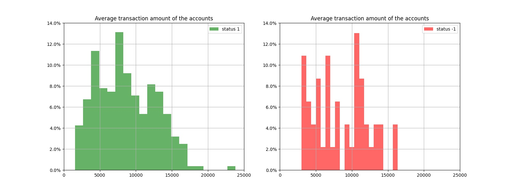
***

## Loan and Account

- Time gap between creating the account and the loan appliance (days between). 
- People who apply for the loan right after creating the bank account tend to be fraudulent.

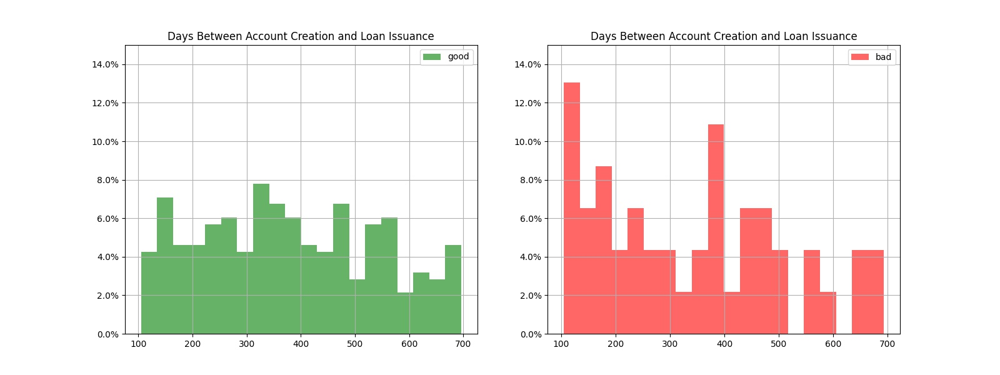

***
# LOGBOOK
- Changed attribute "code" to "district_id" in District table

# TODOs
