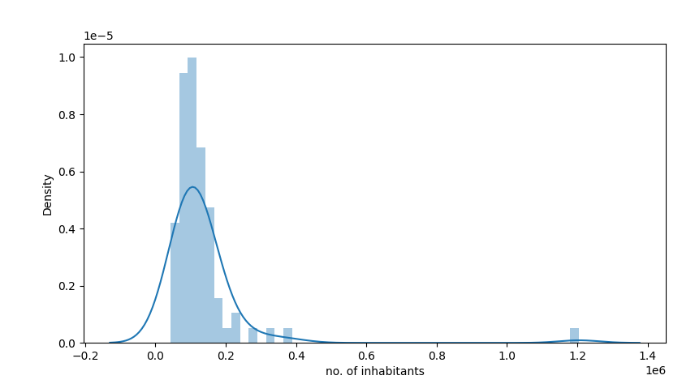
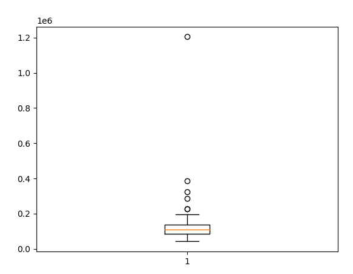
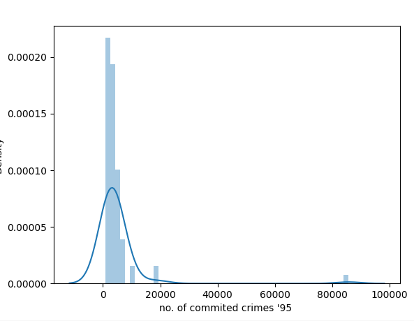
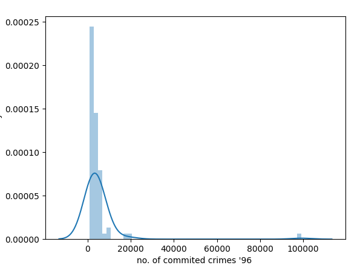
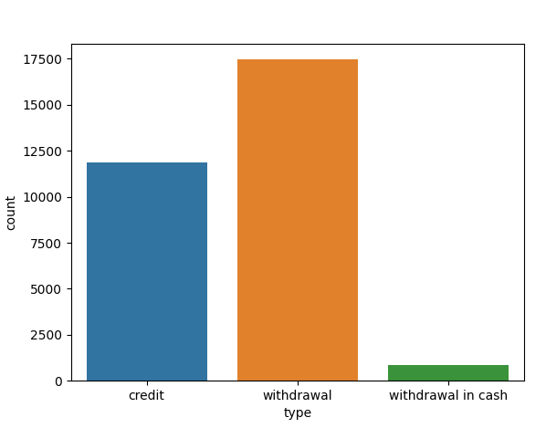

## Data Exploration and Preprocessing Suggestions & Notes

# Client
- Derivar 'gender' e 'birth_date' de 'birth_number': the number is in the form YYMMDD for men, and in the form YYMM+50DD for women

# District
- O atributo unemploymant rate '95 está como object, quando devia ser float: u
    - existe uma row com unemployment rate '95 = '?' 
- O atributo no. of commited crimes '95 está como object, quando devia ser int:
    - existe uma row com uno. of commiter crimes '95 = '?' 

- Possível outlier no atributo 'no. of inhabitants' (max = 1204953, other in range [42821, 387570] )

- Possível outlier nos atributo no. of crimes '95 e '96

# Loan Test
- Tem 354 valores a null, no atributo status

# Transaction Test
- Tem 5130 valores a null, no atributo operation
- Tem 17419 valores a null, no atributo k_symbol
- Tem 24377 valores a null, no atributo bank
- Tem 21061 valores a null, no atributo account

# Transaction Train
- Tem 70761 valores a null, no atributo operation
- Tem 185244 valores a null, no atributo k_symbol
- Tem 299443 valores a null, no atributo bank
- Tem 294456 valores a null, no atributo account

- operation = NaN tem sempre k_symbol = interest credited

- Se uma transferência é feita depois da loan não deveria ser considerada para a análise
- Alterar o valor do atributo 'type' quando este é 'withdrawal in cash' para 'widthdrawal', pois nestes casos o atributo 'operation' já tem esse valor, havendo informação duplicada:

**A analisar com auxílio de gráficos e estatísticas**
- Relevância das informações do destinatário da transferência
- Pertinência de converter o atributo 'value' para para negativo quando 'type'='withdrawal'
- Relevância do atributo k_symbol
